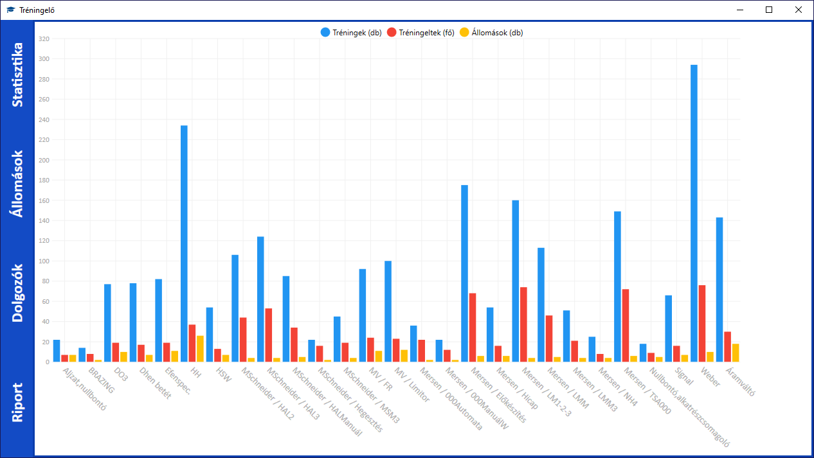
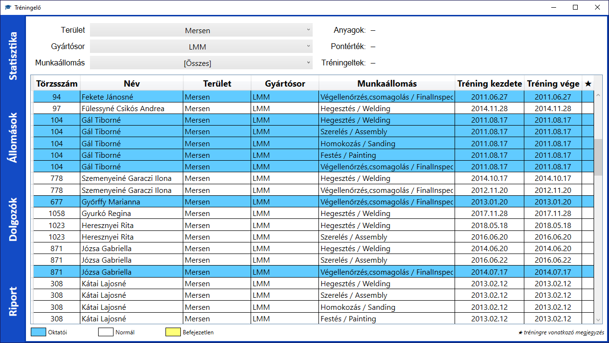
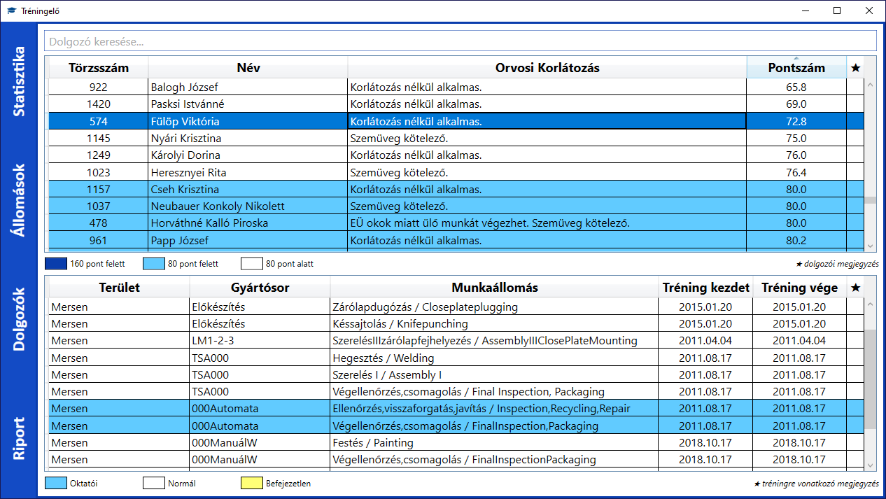
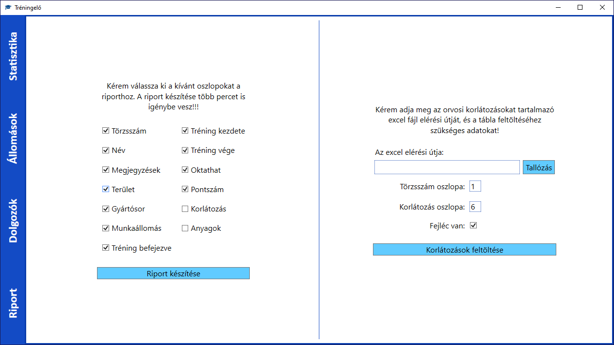

# &nbsp;TrainingMatrix
WPF application for employee training administration and lookup  
Written in C# and XAML

<div style="background-color:dimgray;display:inline-block">
   
   
   
   
</div>

## Main functions
- reading statistics
- adding / editing / removing employees and trainings
- see trained employees by production line and station
- see training by employee
- data import
- report creation
- printing documents

## Source code main directory structure
```
.
├───Commands                # classes implementing the ICommand interface
├───Converters              # value converters for views
├───Models                  # data models to wrap
├───packages                # external dependencies
├───Properties              # assembly information
├───Resources               # images and icon files
├───ViewModels              # wrappers for data models
├───Views                   # xaml
└───Windows                 # xaml
```

## External dependencies
**EntityFramework.6.2.0** - *for a database interface*  
**LiveCharts.0.9.7** - *as a prequisite for LiveCharts.Wpf*  
**LiveCharts.Wpf.0.9.7** - *for generating charts programmatically*  
**Microsoft.Office.Interop.Excel.15.0.4795.1000** - *for generating excel files*  
